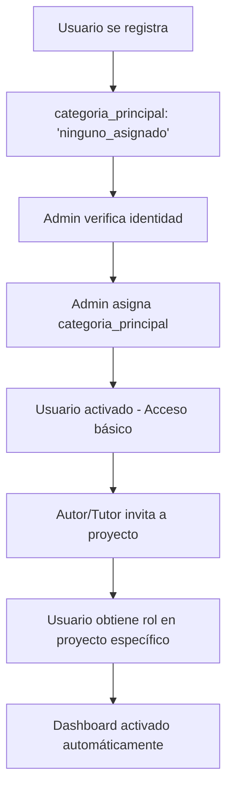

<!-- This is the project's master plan. It defines the WHAT and WHERE, but not the HOW (rules are in /rules.md) -->

# 🏗️ Project Blueprint: La Técnica no se Olvida

## 🎯 Overview

Digital platform for preserving and disseminating rural knowledge and technical projects of CET N°26 students from Ingeniero Jacobacci.

## 🎯 Core Features

### Project Catalog
- Comprehensive project database with detailed information
- Integration of technical analyses, such as satellite data monitoring (NDVI)
- Project relationships and dependencies tracking
- File attachments and documentation management

### Role-Based Security System
- **Hybrid Role Model**: Global roles (admin, moderator) + Project-specific roles (author, tutor, collaborator)
- **Granular Permissions**: Fine-grained access control per feature and entity
- **RLS Integration**: Row Level Security policies enforced at database level
- **Middleware Protection**: Automatic route protection based on role requirements

---

## 🛠️ Tech Stack & Architecture

-   **Frontend:** Next.js 15 (App Router) with React 18 and TypeScript.
-   **Styling:** Tailwind CSS with `shadcn/ui` components.
-   **Backend & Database:** **Supabase**
    -   **Database:** PostgreSQL (relational model).
    -   **Authentication:** Supabase Auth with RLS.
    -   **Storage:** Supabase Storage.
    -   **Serverless Functions:** Supabase Edge Functions.
-   **State Management:** React Context + hooks pattern.
-   **Form Handling:** React Hook Form + Zod validation.
-   **UI Components:** shadcn/ui + Lucide React icons.

---

## 🗂️ Complete Folder Structure

This is the standard folder structure for the project. All new files must be created in their corresponding directory.

```
/src
├── /app/                           # Next.js App Router pages
│   ├── /admin/                     # Admin panel (protected routes)
│   │   ├── layout.tsx              # Admin layout with sidebar
│   │   ├── page.tsx                # Admin dashboard
│   │   ├── /temas/                 # Topics management
│   │   │   ├── page.tsx            # List page (Server Component)
│   │   │   └── /[id]/
│   │   │       └── page.tsx        # Detail page
│   │   ├── /proyectos/             # Projects management
│   │   │   ├── page.tsx            # List page
│   │   │   ├── /new/
│   │   │   │   └── page.tsx        # Create form (dedicated page)
│   │   │   └── /[id]/
│   │   │       ├── page.tsx        # Detail page
│   │   │       └── /edit/
│   │   │           └── page.tsx    # Edit form (dedicated page)
│   │   ├── /noticias/              # News management
│   │   ├── /personas/              # People management
│   │   └── /organizaciones/        # Organizations management
│   ├── /api/                       # API Routes
│   │   └── /admin/                 # Admin API endpoints
│   │       ├── /temas/
│   │       │   └── route.ts        # Temas API with auth
│   │       ├── /proyectos/
│   │       │   └── route.ts        # Proyectos API with auth
│   │       └── /noticias/
│   │           └── route.ts        # Noticias API with auth
│   ├── /(public)/                  # Public pages grouping
│   │   ├── /temas/
│   │   │   ├── page.tsx            # Topics listing
│   │   │   └── /[id]/
│   │   │       └── page.tsx        # Topic detail
│   │   ├── /proyectos/
│   │   │   ├── page.tsx            # Projects listing
│   │   │   └── /[id]/
│   │   │       └── page.tsx        # Project detail
│   │   └── /comunidad/
│   │       └── /personas/
│   │           └── /[id]/
│   │               └── page.tsx    # Person profile
│   ├── /login/
│   │   └── page.tsx                # Authentication page
│   ├── layout.tsx                  # Root layout with AuthProvider
│   ├── page.tsx                    # Homepage
│   └── globals.css                 # Global styles
├── /components/                    # Reusable UI components
│   ├── /admin/                     # Admin-specific components
│   │   ├── AdminDataTable.tsx      # Reusable data table
│   │   ├── AdminSidebar.tsx        # Admin navigation
│   │   ├── AdminHeader.tsx         # Admin header
│   │   └── /[entity]/              # Entity-specific components
│   │       ├── [Entity]Form.tsx    # Form component
│   │       └── [Entity]ListPage.tsx # List page component
│   ├── /common/                    # Shared components
│   │   ├── BackButton.tsx          # Navigation helper
│   │   └── LoadingSpinner.tsx      # Loading states
│   └── /ui/                        # shadcn/ui components
│       ├── button.tsx
│       ├── input.tsx
│       ├── form.tsx
│       └── ...                     # Other UI primitives
├── /hooks/                         # Custom React hooks
│   ├── useDataTableState.ts        # Table state management
│   ├── usePermissions.ts           # Permission checking (future)
│   └── use-mobile.tsx              # Mobile detection
├── /lib/                           # Utilities and integrations
│   ├── /supabase/                  # Supabase integration
│   │   ├── client.ts               # Browser client
│   │   ├── server.ts               # Server client (SSR)
│   │   ├── /services/              # Database services
│   │   │   ├── temasService.ts     # Topics service
│   │   │   ├── proyectosService.ts # Projects service
│   │   │   ├── noticiasService.ts  # News service
│   │   │   ├── personasService.ts  # People service
│   │   │   ├── authService.ts      # Authentication service
│   │   │   └── storageService.ts   # File upload service
│   │   ├── /types/                 # Type definitions
│   │   │   ├── database.types.ts   # Generated DB types
│   │   │   └── serviceResult.ts    # Service response types
│   │   └── /errors/                # Error handling
│   │       ├── types.ts            # Error type definitions
│   │       └── utils.ts            # Error utilities
│   ├── /schemas/                   # Zod validation schemas
│   │   ├── temaSchema.ts           # Topic validation
│   │   ├── proyectoSchema.ts       # Project validation
│   │   └── personaSchema.ts        # Person validation
│   ├── /constants/                 # App constants
│   │   └── persona.ts              # Person-related constants
│   ├── /validations/               # Validation utilities
│   │   └── persona.ts              # Person validation helpers
│   └── utils.ts                    # General utilities (cn, etc.)
├── /providers/                     # React Context providers
│   └── AuthProvider.tsx            # Authentication context
└── /styles/                        # Styling files
    └── globals.css                 # Global CSS with design tokens

/docs/                              # Project documentation
├── changelog.md                    # Change history
├── schemas.md                      # Database schema docs
├── future-developments.md          # Planned features
├── todos.md                        # Technical debt tracking
└── /features/                      # Feature documentation
    ├── authentication.md           # Auth system docs
    ├── personas.md                 # People management docs
    └── proyectos.md                # Projects management docs

/                                   # Root files
├── blueprint.md                    # This file
├── rules.md                        # Development rules
├── package.json                    # Dependencies
├── tsconfig.json                   # TypeScript config
├── tailwind.config.ts              # Tailwind config
├── next.config.ts                  # Next.js config
└── .env.local                      # Environment variables
```

---

## 🏛️ Architectural Patterns

### "Standalone" Service Pattern
After a complete refactoring, the project uses an explicit, inheritance-free service pattern. All new entity services (e.g., `proyectosService`, `noticiasService`) **must** follow these rules:
-   **No Inheritance:** They are `standalone` classes that don't extend any base class.
-   **Explicit Methods:** They implement their own `create`, `update`, `getById`, `getAll`, and `delete`.
-   **Local Types:** They define their types (`Row`, `Insert`, `Update`) at the beginning of the file, imported from `database.types.ts`.
-   **Singleton Export:** The file exports a single instance of the service (e.g., `export const temasService = new TemasService();`).
-   **Location:** `/src/lib/supabase/services/`.

### Data Fetching Patterns

#### Server Components + API Routes Pattern (Current)
- **Server Components**: Initial data loading using API routes
- **API Routes**: Handle authentication and RLS logic
- **Example**: `app/admin/temas/page.tsx` → `app/api/admin/temas/route.ts` → `temasService`

#### Authentication Flow
- **AuthProvider**: Manages session state and admin status
- **RPC Functions**: `is_admin()` function for role checking
- **RLS Policies**: Database-level security enforcement
- **Middleware**: Route protection (future enhancement)

### Form Patterns

#### Modal Forms (Simple Entities)
- **Use Case**: Simple entities like Topics (temas)
- **Pattern**: Modal dialog with form inside list page
- **Components**: `TemaForm.tsx` + `Dialog` from shadcn/ui
- **Navigation**: Stays on the same page

#### Dedicated Page Forms (Complex Entities)
- **Use Case**: Complex entities like Projects, News
- **Pattern**: Separate pages for create/edit operations
- **Routes**: `/new` for create, `/[id]/edit` for update
- **Navigation**: Browser navigation between pages

### UI Patterns
-   **Admin Sidebar Pattern:** The admin panel uses a layout with a persistent sidebar on desktop and collapsible on mobile.
-   **AdminDataTable Pattern:** All data management lists in the admin must use the reusable `AdminDataTable` component, powered by the `useDataTableState` hook.
-   **Soft Delete Pattern:** All entities support logical deletion with restore functionality.
-   **Toast Notifications:** User feedback via toast messages for all operations.

---

## 🔐 Security Architecture

## 🔐 Arquitectura de Seguridad - DEFINICIÓN ACTUALIZADA

### **📋 Conceptos Clave: Categorías vs Roles**

#### **👤 Categorías de Persona (QUÉ ERES - Identidad Institucional)**
```sql
categoria_principal_persona_enum:
- 'estudiante_cet'     -- Estudiantes actuales del CET  
- 'ex_alumno_cet'      -- Graduados del CET
- 'productor_rural'    -- Productores agropecuarios locales
- 'profesional_externo' -- Profesionales de diversas áreas
- 'investigador'       -- Investigadores académicos
- 'comunidad_general'  -- Miembros de la comunidad local
- 'otro'               -- Casos especiales
- 'ninguno_asignado'   -- Estado temporal hasta verificación
```
**Características:** Permanente/semi-permanente, no cambia con proyectos

#### **🛡️ Roles Globales (QUÉ PUEDES HACER EN EL SISTEMA)**
```sql
tabla 'persona_roles':
- 'admin'      -- Acceso completo al sistema
- 'moderator'  -- Capacidades moderación contenido (futuro)
```
**Características:** Permisos a nivel sistema, asignados por admin

#### **🎯 Roles por Proyecto (QUÉ HACES EN PROYECTOS ESPECÍFICOS)**
```sql
tabla 'proyecto_persona_rol':
- 'autor'       -- Gestión total del proyecto (creador)
- 'tutor'       -- Gestión total del proyecto (mentor) 
- 'colaborador' -- Solo agregar contenido específico
```
**Características:** Dinámico, varía entre proyectos, múltiples roles posibles

---

### **💡 Casos de Uso Reales**

#### **Ejemplo 1: Ex-alumno como Tutor**
```
categoria_principal: 'ex_alumno_cet'
+ rol en Proyecto A: 'tutor' 
+ rol en Proyecto B: 'colaborador'
→ Dashboard: Ve y gestiona Proyecto A + colabora en Proyecto B
```

#### **Ejemplo 2: Estudiante Actual**  
```
categoria_principal: 'estudiante_cet'
+ rol en Su Proyecto: 'autor'
+ rol en Proyecto Grupal: 'colaborador'  
→ Dashboard: Gestiona su proyecto + colabora en proyecto grupal
```

#### **Ejemplo 3: Productor Rural**
```
categoria_principal: 'productor_rural'
+ rol en Proyecto X: 'colaborador'
→ Dashboard: Solo puede agregar contenido específico a Proyecto X
```

---

### **🎯 Lógica de Acceso al Dashboard**

#### **✅ Usuarios que SÍ necesitan dashboard:**
- **Admins**: Siempre tienen acceso
- **Cualquier usuario con roles activos en proyectos**: `autor`, `tutor`, `colaborador`

#### **❌ Usuarios que NO necesitan dashboard:**
- **Usuarios sin roles en proyectos**: Solo acceso de lectura + IA

#### **🔧 Lógica de Creación de Proyectos:**
- **Solo pueden crear proyectos**: `estudiante_cet`, `ex_alumno_cet`, `admins`
- **Resto de categorías**: Pueden ser invitados como tutores/colaboradores

---

### **🏗️ Flujo de Asignación de Roles**



---

### **⚙️ Implementación Técnica**

#### **Dashboard Access Logic**
```typescript
const needsDashboard = user && (
  isAdmin || 
  hasActiveProjectRoles(user.id) // Función que chequea tabla proyecto_persona_rol
);

const canCreateProjects = user && (
  isAdmin ||
  user.categoria_principal_persona === 'estudiante_cet' ||
  user.categoria_principal_persona === 'ex_alumno_cet'
);
```

#### **Función Helper**
```typescript
async function hasActiveProjectRoles(userId: string): Promise {
  // Chequear si tiene algún rol activo en proyecto_persona_rol
  const { data } = await supabase
    .from('proyecto_persona_rol')
    .select('id')
    .eq('persona_id', userId)
    .eq('is_deleted', false)
    .limit(1);
    
  return data && data.length > 0;
}
```

---

### **📝 Notas Importantes**

- **Docentes CET**: Tendrán rol `admin` (no categoría especial)
- **Categorías `_invitado`**: Son placeholders de uso interno, se eliminarán
- **Múltiples roles**: Un usuario puede tener diferentes roles en diferentes proyectos
- **Escalabilidad**: Sistema preparado para agregar nuevos roles por proyecto### RLS (Row Level Security) Policies
- **Read Policies**: Control data visibility based on user role
- **Write Policies**: Control data modification permissions
- **Admin Override**: Admins can see/edit all content including soft-deleted

### Future Security Enhancements
- **usePermissions Hook**: Granular permission checking
- **Middleware**: Automatic route protection
- **API Route Guards**: Centralized auth checking

---

## 🎨 Style and Design Guide

### Color Palette
-   **Primary Color:** Muted violet (`#A994D9`). Represents creativity and wisdom.
-   **Background Color:** Very light blue (`#EBF4FA`). Creates a calm and reliable base.
-   **Accent Color:** Desaturated green (`#98D9A2`). Evokes rural origins.
-   **Error Color:** Red variants from Tailwind
-   **Success Color:** Green variants from Tailwind

### Design Tokens (CSS Variables)
```css
:root {
  --background: 207 67% 95%;           /* very light blue #EBF4FA */
  --foreground: 210 20% 15%;           /* dark grey */
  --primary: 261 43% 70%;              /* muted violet #A994D9 */
  --accent: 128 51% 75%;               /* desaturated green #98D9A2 */
  /* ... other tokens defined in globals.css */
}
```

### Typography
-   **Font Family:** Inter (clean, modern sans-serif)
-   **Headings:** Bold, clear hierarchy
-   **Body Text:** Readable, appropriate line height
-   **Code Text:** Monospace font for technical content

### Icons and Visual Elements
-   **Icons:** Simple and illustrative (`lucide-react`)
-   **Spacing:** Consistent spacing scale (Tailwind)
-   **Borders:** Subtle, rounded corners
-   **Shadows:** Minimal, purposeful shadows

### UX Principles
-   **Modern and Clean**: Use a modern and minimalist design that reflects the technical nature of the project.
-   **Consistency**: Maintain a coherent color palette and styles throughout the application.
-   **Accessibility**: Ensure the application is accessible to all users, following WCAG 2.1.
-   **Responsive Design**: The application must be fully functional and usable on mobile devices.
-   **Visual Feedback**: Provide clear feedback for all user actions.
-   **Intuitive Navigation**: Clear and easy-to-understand structure.

---

## 🚀 Current Development Status

### ✅ Completed Features
- **Authentication System**: Login/logout with Supabase Auth
- **Admin Dashboard**: Basic layout with sidebar navigation
- **Topics Management**: Complete CRUD with modal forms
- **Projects Management**: Complete CRUD with dedicated page forms
- **Data Table Component**: Reusable AdminDataTable with search/filter
- **Soft Delete System**: Logical deletion with restore functionality
- **RLS Security**: Basic row-level security policies

### 🚧 In Progress
- **API Routes Migration**: Moving from Client Components to Server Components + API Routes
- **Enhanced RLS**: Expanding security policies to all entities

### 📋 Next Priorities
1. **Complete News Management**: Implement full CRUD for noticias
2. **People Management**: Implement full CRUD for personas
3. **Organizations Management**: Implement full CRUD for organizaciones
4. **Role Management**: Implement advanced permission system
5. **File Upload**: Integrate Supabase Storage for file handling

---

## 📖 Related Documentation

- **[Development Rules](./rules.md)**: Coding standards and development workflow
- **[Changelog](./docs/changelog.md)**: Complete change history
- **[Database Schema](./docs/schemas.md)**: Database structure documentation
- **[Future Developments](./docs/future-developments.md)**: Planned features and improvements
- **[TODOs](./docs/todos.md)**: Technical debt and pending tasks