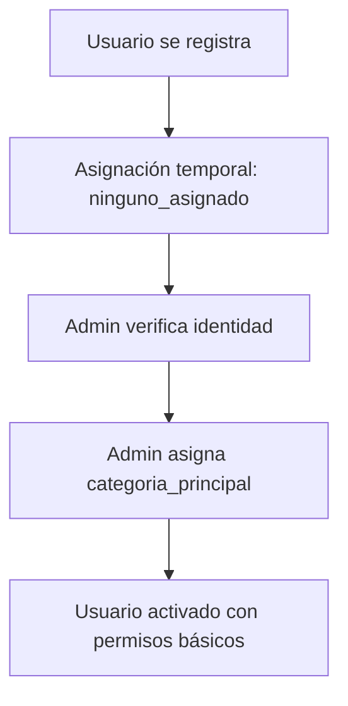

# 🏗️ Project Blueprint: La Técnica no se Olvida

## 🎯 Overview
Plataforma digital para preservar y diseminar conocimiento rural y proyectos técnicos de estudiantes del CET N°26 de Ingeniero Jacobacci.

## 🛠️ Tech Stack & Arquitectura
- **Frontend:** Next.js 15 (App Router) con React 18 y TypeScript
- **Styling:** Tailwind CSS con componentes `shadcn/ui`
- **Backend & Database:** Supabase (PostgreSQL, Auth, Storage, Edge Functions)
- **State Management:** React Context + hooks pattern
- **Form Handling:** React Hook Form + Zod validation
- **UI Components:** shadcn/ui + Lucide React icons

## 🗂️ Estructura de Carpetas Completa

```
/src
├── /app/                           # Next.js App Router pages
│   ├── /admin/                     # Panel admin (rutas protegidas)
│   │   ├── layout.tsx              # Layout admin con sidebar
│   │   ├── page.tsx                # Dashboard admin
│   │   ├── /temas/                 # Gestión de temas
│   │   │   ├── page.tsx            # Página lista (Server Component)
│   │   │   └── /[id]/page.tsx      # Página detalle
│   │   ├── /proyectos/             # Gestión de proyectos
│   │   │   ├── page.tsx            # Página lista
│   │   │   ├── /new/page.tsx       # Formulario crear (página dedicada)
│   │   │   └── /[id]/
│   │   │       ├── page.tsx        # Página detalle
│   │   │       └── /edit/page.tsx  # Formulario editar (página dedicada)
│   │   ├── /personas/              # Gestión de personas
│   │   │   ├── page.tsx            # Lista personas con AdminDataTable
│   │   │   ├── /new/page.tsx       # Crear nueva persona
│   │   │   └── /[id]/edit/page.tsx # Editar persona
│   │   ├── /organizaciones/        # Gestión de organizaciones
│   │   │   ├── page.tsx            # Lista organizaciones
│   │   │   ├── /new/page.tsx       # Crear organización
│   │   │   └── /[id]/edit/page.tsx # Editar organización
│   │   └── /noticias/              # Gestión de noticias
│   │       ├── page.tsx            # Lista noticias
│   │       ├── /new/page.tsx       # Crear noticia
│   │       └── /[id]/edit/page.tsx # Editar noticia
│   ├── /api/                       # API Routes
│   │   └── /admin/                 # Endpoints admin
│   │       ├── /temas/route.ts     # API Temas con auth
│   │       ├── /proyectos/route.ts # API Proyectos con auth
│   │       ├── /personas/route.ts  # API Personas con auth
│   │       ├── /organizaciones/route.ts # API Organizaciones con auth
│   │       └── /noticias/route.ts  # API Noticias con auth
│   ├── /(public)/                  # Páginas públicas
│   │   ├── /temas/
│   │   │   ├── page.tsx            # Lista temas públicos
│   │   │   └── /[id]/page.tsx      # Detalle tema público
│   │   ├── /proyectos/
│   │   │   ├── page.tsx            # Lista proyectos públicos
│   │   │   └── /[id]/page.tsx      # Detalle proyecto público
│   │   ├── /noticias/
│   │   │   ├── page.tsx            # Lista noticias públicas
│   │   │   └── /[id]/page.tsx      # Detalle noticia pública
│   │   └── /comunidad/
│   │       └── /personas/
│   │           └── /[id]/page.tsx  # Perfil persona público
│   ├── /login/page.tsx             # Página autenticación
│   ├── layout.tsx                  # Layout root con AuthProvider
│   ├── page.tsx                    # Homepage
│   └── globals.css                 # Estilos globales
├── /components/                    # Componentes UI reutilizables
│   ├── /admin/                     # Componentes específicos admin
│   │   ├── AdminDataTable.tsx      # Tabla de datos reutilizable
│   │   ├── AdminSidebar.tsx        # Navegación admin
│   │   └── /[entity]/              # Componentes específicos entidad
│   │       ├── TemasForm.tsx       # Formulario temas (modal)
│   │       ├── ProyectosForm.tsx   # Formulario proyectos (página)
│   │       ├── PersonasForm.tsx    # Formulario personas (página)
│   │       ├── OrganizacionesForm.tsx # Formulario organizaciones (página)
│   │       └── NoticiasForm.tsx    # Formulario noticias (página)
│   ├── /common/                    # Componentes compartidos
│   │   ├── BackButton.tsx          # Helper navegación
│   │   └── LoadingSpinner.tsx      # Estados carga
│   └── /ui/                        # Componentes shadcn/ui
│       ├── button.tsx
│       ├── input.tsx
│       ├── dialog.tsx
│       ├── form.tsx
│       └── ...                     # Otros primitivos UI
├── /hooks/                         # Custom React hooks
│   ├── useDataTableState.ts        # Gestión estado tabla
│   ├── usePermissions.ts           # Verificación permisos (futuro)
│   └── use-mobile.tsx              # Detección móvil
├── /lib/                           # Utilidades e integraciones
│   ├── /supabase/                  # Integración Supabase
│   │   ├── client.ts               # Cliente browser
│   │   ├── server.ts               # Cliente servidor (SSR)
│   │   ├── /services/              # Servicios base de datos
│   │   │   ├── temasService.ts     # Servicio temas ✅
│   │   │   ├── proyectosService.ts # Servicio proyectos (básico)
│   │   │   ├── personasService.ts  # Servicio personas (pendiente)
│   │   │   ├── organizacionesService.ts # Servicio organizaciones (pendiente)
│   │   │   ├── noticiasService.ts  # Servicio noticias (pendiente)
│   │   │   └── authService.ts      # Servicio autenticación ✅
│   │   ├── /types/                 # Definiciones tipos
│   │   │   ├── database.types.ts   # Tipos DB generados
│   │   │   └── serviceResult.ts    # Tipos respuesta servicio
│   │   └── /errors/                # Manejo errores
│   │       ├── types.ts            # Definiciones tipos error
│   │       └── utils.ts            # Utilidades error
│   ├── /schemas/                   # Esquemas validación Zod
│   │   ├── temaSchema.ts           # Validación tema ✅
│   │   ├── proyectoSchema.ts       # Validación proyecto
│   │   ├── personaSchema.ts        # Validación persona (pendiente)
│   │   ├── organizacionSchema.ts   # Validación organización (pendiente)
│   │   └── noticiaSchema.ts        # Validación noticia (pendiente)
│   └── utils.ts                    # Utilidades generales (cn, etc.)
├── /providers/                     # Providers React Context
│   └── AuthProvider.tsx            # Contexto autenticación ✅
└── /styles/
    └── globals.css                 # CSS global con tokens diseño
```

## 🏛️ Patrones Arquitectónicos

### Patrón "Standalone" Service
Todos los servicios de entidad deben seguir estas reglas:
- **Sin Herencia:** Clases `standalone` que no extienden clase base
- **Métodos Explícitos:** Implementan sus propios `create`, `update`, `getById`, `getAll`, `delete`
- **Tipos Locales:** Definen tipos (`Row`, `Insert`, `Update`) al inicio del archivo
- **Export Singleton:** Exportan una sola instancia del servicio
- **Ubicación:** `/src/lib/supabase/services/`

### Patrón Data Fetching
Patrón Server Components vs Client Components
✅ USAR Server Components (Recomendado)

Para: Páginas admin de listado y detalle de entidades
Ventajas:

RLS funciona correctamente (datos se cargan en el servidor)
Mejor performance (menos JavaScript en el cliente)
SEO mejorado
Menos problemas de permisos


Patrón:
typescript// ✅ CORRECTO: Server Component
export default async function EntidadPage() {
  const result = await entidadService.getAll(true);
  if (!result.success) return <ErrorView />;
  return <EntidadListPage allEntidades={result.data} />;
}


❌ EVITAR Client Components para Data Fetching

Problemas:

RLS más restrictivo en el cliente
useEffect + useState genera complejidad innecesaria
Problemas de hidratación
Peor UX (loading states adicionales)


Anti-patrón:
typescript// ❌ INCORRECTO: Client Component innecesario
"use client";
export default function EntidadPage() {
  const [data, setData] = useState([]);
  useEffect(() => { /* fetch data */ }, []);
  // ...más código complejo
}


🎯 Cuándo SÍ usar Client Components

Interactividad: Formularios, modales, componentes con estado local
Hooks específicos: useRouter, useAuth para acciones
Event handlers: onClick, onChange, etc.

📋 Checklist Migración a Server Components

✅ Remover "use client" de páginas de listado/detalle
✅ Cambiar función a async
✅ Usar await servicioEntidad.getAll() directamente
✅ Manejar errores con return <ErrorComponent />
✅ Pasar datos como props a componentes Client


#### Server Components + API Routes (Actual)
- **Server Components**: Carga inicial de datos usando API routes
- **API Routes**: Manejan autenticación y lógica RLS
- **AuthProvider**: Gestiona estado de sesión y estado admin
- **RLS Policies**: Seguridad a nivel de base de datos

## 🔐 Arquitectura de Seguridad

### Sistema de Roles

#### Roles Globales (tabla persona_roles)
- **admin**: Acceso completo al sistema
- **moderator**: Capacidades moderación contenido
- **editor**: Creación y edición contenido

#### Roles Específicos por Proyecto (tabla proyecto_persona_rol)
- **autor**: Creador/dueño proyecto
- **tutor**: Mentor proyecto (puede ser diferentes proyectos)
- **colaborador**: Acceso edición limitado
- **revisor**: Permisos revisión y feedback

#### Niveles de Permisos
1. **Anónimo**: Acceso solo lectura a contenido publicado
2. **Usuario Autenticado**: Acceso a dashboard personal + features IA
3. **Creador Contenido**: Gestión su propio contenido
4. **Admin**: Acceso completo sistema

### Políticas RLS (Row Level Security)
- **Políticas Lectura**: Controlan visibilidad datos basado en rol usuario
- **Políticas Escritura**: Controlan permisos modificación datos
- **Override Admin**: Admins pueden ver/editar todo contenido incluyendo soft-deleted

## 🎭 Tipos de Usuario y Permisos Detallados

### Categorías de Persona (categoria_principal_persona_enum)

#### 🎓 Comunidad CET N°26
- **docente_cet**: Profesores y staff del CET
  - *Permisos*: Acceso completo admin, gestión estudiantes/proyectos
- **estudiante_cet**: Estudiantes actuales del CET
  - *Permisos*: Crear proyectos propios, colaborar en proyectos asignados
- **ex_alumno_cet**: Graduados del CET
  - *Permisos*: Cargar proyectos históricos, mentorear estudiantes actuales

#### 🏫 Roles de Mentores y Apoyo
- **tutor_invitado**: Mentores externos e internos
  - *Permisos*: Acceso completo a proyectos asignados, guiar estudiantes
- **colaborador_invitado**: Apoyo especializado en proyectos
  - *Permisos*: Editar contenido específico de proyectos asignados
- **autor_invitado**: Creadores de contenido externo
  - *Permisos*: Crear contenido propio, gestionar sus contribuciones

#### 🌾 Comunidad Rural y Externa
- **productor_rural**: Productores agropecuarios locales
  - *Permisos*: Compartir conocimiento práctico, acceso contenido técnico
- **profesional_externo**: Profesionales de diversas áreas
  - *Permisos*: Aportar expertise, revisar proyectos técnicos
- **investigador**: Investigadores académicos o independientes
  - *Permisos*: Acceso completo para investigación, colaborar en estudios
- **comunidad_general**: Miembros de la comunidad local
  - *Permisos*: Acceso lectura, participación limitada en discusiones

#### 🔧 Roles Administrativos Especiales
- **otro**: Casos especiales no cubiertos por categorías anteriores
- **ninguno_asignado**: Estado temporal hasta verificación/asignación

### Flujo de Gestión de Usuarios

#### 1. Registro y Verificación


#### 2. Asignación de Roles Globales
- Solo admins pueden asignar roles globales (admin, moderator, editor)
- Se registran en tabla `persona_roles`
- Permiten acceso transversal al sistema

#### 3. Asignación de Roles por Proyecto
- Autores de proyectos asignan colaboradores
- Tutores pueden asignar estudiantes
- Se registran en tabla `proyecto_persona_rol`

## 🎨 Guía de Estilo y Diseño

### Paleta de Colores
- **Color Primario:** Violeta suave (`#A994D9`) - Representa creatividad y sabiduría
- **Color Fondo:** Azul muy claro (`#EBF4FA`) - Crea base calmada y confiable
- **Color Acento:** Verde desaturado (`#98D9A2`) - Evoca orígenes rurales
- **Color Error:** Variantes rojas de Tailwind
- **Color Éxito:** Variantes verdes de Tailwind

### Tokens de Diseño (Variables CSS)
```css
:root {
  --background: 207 67% 95%;           /* azul muy claro #EBF4FA */
  --foreground: 210 20% 15%;           /* gris oscuro */
  --primary: 261 43% 70%;              /* violeta suave #A994D9 */
  --accent: 128 51% 75%;               /* verde desaturado #98D9A2 */
}
```

### Principios UX
- **Moderno y Limpio**: Diseño moderno y minimalista
- **Consistencia**: Paleta colores y estilos coherentes
- **Accesibilidad**: Siguiendo WCAG 2.1
- **Diseño Responsivo**: Completamente funcional en dispositivos móviles
- **Feedback Visual**: Feedback claro para todas las acciones usuario

## 🚀 Estado Actual Desarrollo

### ✅ Features Completadas
- **Sistema Autenticación**: Login/logout con Supabase Auth
- **AuthProvider**: Gestión de sesión y verificación de admin
- **Dashboard Admin**: Layout básico con navegación sidebar
- **Gestión Temas**: CRUD completo con formularios modal y RLS
- **Gestión Proyectos**: CRUD básico con formularios página dedicada
- **Componente AdminDataTable**: Tabla reutilizable con búsqueda/filtro
- **Sistema Soft Delete**: Borrado lógico con funcionalidad restaurar
- **Esquemas de Base de Datos**: Diseño completo y documentado
- **Seguridad RLS**: Políticas básicas implementadas para temas

### 🚧 En Progreso (Fase 1A)
- **RLS Expandido**: Implementando políticas para personas, proyectos, organizaciones, noticias
- **Utilidades de Permisos**: Creando helpers para verificación de roles

### 📋 Próximas Prioridades
1. **Completar RLS (Fase 1A)**: Políticas de seguridad para todas las entidades
2. **Gestión Personas**: CRUD completo con manejo de categorías
3. **Gestión Organizaciones**: Sistema de gestión completo
4. **Gestión Noticias**: CRUD completo con tipos de contenido
5. **Sistema de Permisos Avanzado**: Hook usePermissions
6. **Upload Archivos**: Integrar Supabase Storage para manejo archivos

---

*Blueprint actualizado para reflejar el estado real del proyecto y guiar el desarrollo futuro.*