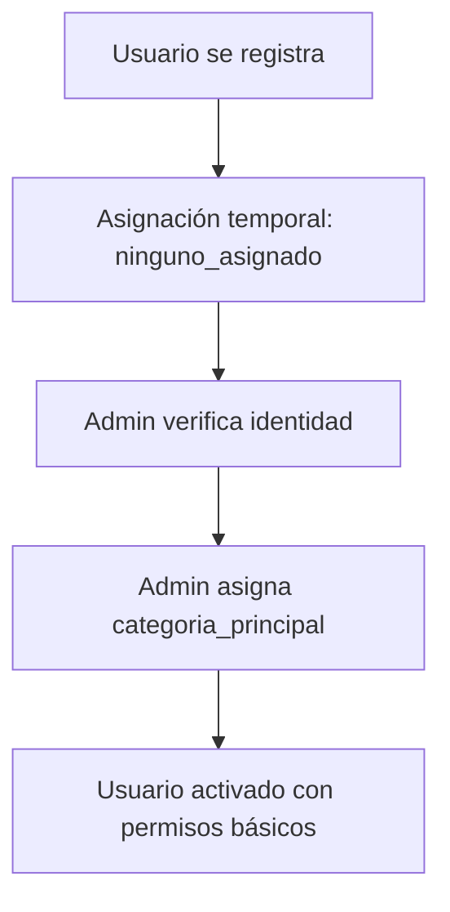

# 🏗️ Project Blueprint: La Técnica no se Olvida

## 🎯 Overview
Plataforma digital para preservar y diseminar conocimiento rural y proyectos técnicos de estudiantes del CET N°26 de Ingeniero Jacobacci.

## 🛠️ Tech Stack & Arquitectura
- **Frontend:** Next.js 15 (App Router) con React 18 y TypeScript
- **Styling:** Tailwind CSS con componentes `shadcn/ui`
- **Backend & Database:** Supabase (PostgreSQL, Auth, Storage, Edge Functions)
- **State Management:** React Context + hooks pattern
- **Form Handling:** React Hook Form + Zod validation
- **UI Components:** shadcn/ui + Lucide React icons

## 🗂️ Estructura de Carpetas y Estado Actual

```
/src
├── /app/                           # Next.js App Router pages
│   ├── /admin/                     # Panel admin (rutas protegidas)
│   │   ├── layout.tsx              # Layout admin con sidebar ✅
│   │   ├── page.tsx                # Dashboard admin ✅
│   │   ├── /temas/                 # ✅ Completo (Client Components)
│   │   │   ├── page.tsx            # Lista temas (Client Component)
│   │   │   └── /[id]/page.tsx      # Detalle tema
│   │   ├── /proyectos/             # 🔄 Básico implementado (Client Components)
│   │   │   ├── page.tsx            # Lista proyectos
│   │   │   ├── /new/page.tsx       # Formulario crear (página dedicada)
│   │   │   └── /[id]/
│   │   │       ├── page.tsx        # Página detalle
│   │   │       └── /edit/page.tsx  # Formulario editar
│   │   ├── /noticias/              # ✅ Completo (Client Components)
│   │   │   ├── page.tsx            # Lista noticias
│   │   │   ├── /new/page.tsx       # Crear noticia
│   │   │   └── /[id]/edit/page.tsx # Editar noticia
│   │   ├── /personas/              # ❌ Pendiente
│   │   │   ├── page.tsx            # Lista personas con AdminDataTable
│   │   │   ├── /new/page.tsx       # Crear nueva persona
│   │   │   └── /[id]/edit/page.tsx # Editar persona
│   │   └── /organizaciones/        # ❌ Pendiente
│   │       ├── page.tsx            # Lista organizaciones
│   │       ├── /new/page.tsx       # Crear organización
│   │       └── /[id]/edit/page.tsx # Editar organización
│   ├── /api/admin/                 # API Routes con auth
│   │   ├── /temas/route.ts         # API Temas ✅
│   │   ├── /proyectos/route.ts     # API Proyectos 🔄
│   │   ├── /noticias/route.ts      # API Noticias ✅
│   │   ├── /personas/route.ts      # API Personas ❌
│   │   └── /organizaciones/route.ts # API Organizaciones ❌
│   ├── /(public)/                  # Páginas públicas (futuro)
│   ├── /login/page.tsx             # Página autenticación ✅
│   ├── layout.tsx                  # Layout root con AuthProvider ✅
│   ├── page.tsx                    # Homepage ✅
│   └── globals.css                 # Estilos globales ✅
├── /components/                    # Componentes UI reutilizables
│   ├── /admin/                     # Componentes admin
│   │   ├── AdminDataTable.tsx      # ✅ Tabla reutilizable
│   │   ├── AdminSidebar.tsx        # ✅ Navegación admin
│   │   ├── /temas/
│   │   │   ├── TemasListPage.tsx   # ✅ Client Component
│   │   │   └── TemasForm.tsx       # ✅ Modal
│   │   ├── /proyectos/
│   │   │   ├── ProyectosListPage.tsx # 🔄 Client Component básico
│   │   │   └── ProyectoForm.tsx    # ✅ Página dedicada
│   │   ├── /noticias/
│   │   │   ├── NoticiasListPage.tsx # ✅ Client Component
│   │   │   └── NoticiaForm.tsx     # ✅ Página dedicada
│   │   ├── /personas/              # ❌ Pendiente
│   │   └── /organizaciones/        # ❌ Pendiente
│   ├── /common/                    # Componentes compartidos
│   │   ├── BackButton.tsx          # ✅ Helper navegación
│   │   └── LoadingSpinner.tsx      # Estados carga
│   └── /ui/                        # Componentes shadcn/ui ✅
├── /hooks/                         # Custom React hooks
│   ├── useDataTableState.ts        # ✅ Gestión estado tabla
│   ├── usePermissions.ts           # ❌ Verificación permisos (futuro)
│   └── use-mobile.tsx              # ✅ Detección móvil
├── /lib/                           # Utilidades e integraciones
│   ├── /supabase/                  # Integración Supabase
│   │   ├── client.ts               # ✅ Cliente browser
│   │   ├── server.ts               # ✅ Cliente servidor (SSR)
│   │   ├── /services/              # Servicios base de datos
│   │   │   ├── temasService.ts     # ✅ Servicio completo
│   │   │   ├── proyectosService.ts # 🔄 Básico
│   │   │   ├── noticiasService.ts  # ✅ Servicio completo
│   │   │   ├── personasService.ts  # ❌ Pendiente
│   │   │   ├── organizacionesService.ts # ❌ Pendiente
│   │   │   └── authService.ts      # ✅ Autenticación
│   │   ├── /types/                 # Definiciones tipos
│   │   │   ├── database.types.ts   # ⚠️ Necesita regeneración
│   │   │   └── serviceResult.ts    # ✅ Tipos respuesta servicio
│   │   └── /errors/                # Manejo errores
│   │       ├── types.ts            # ✅ Definiciones tipos error
│   │       └── utils.ts            # ✅ Utilidades error
│   ├── /schemas/                   # Esquemas validación Zod
│   │   ├── temaSchema.ts           # ✅ Validación completa
│   │   ├── proyectoSchema.ts       # ✅ Validación completa
│   │   ├── noticiaSchema.ts        # ✅ Validación completa
│   │   ├── personaSchema.ts        # ❌ Pendiente
│   │   └── organizacionSchema.ts   # ❌ Pendiente
│   └── utils.ts                    # ✅ Utilidades generales
└── /providers/                     # Providers React Context
    └── AuthProvider.tsx            # ✅ Contexto autenticación
```

## 🏛️ Patrones Arquitectónicos

### Patrón "Standalone" Service
Todos los servicios de entidad siguen estas reglas:
- **Sin Herencia:** Clases `standalone` que no extienden clase base
- **Métodos Explícitos:** Implementan `create`, `update`, `getById`, `getAll`, `delete`, `restore`
- **Tipos Locales:** Definen tipos (`Row`, `Insert`, `Update`) al inicio del archivo
- **Export Singleton:** Exportan una sola instancia del servicio
- **Ubicación:** `/src/lib/supabase/services/`

### Patrón Client Components (Implementado y Funcional)

**✅ PATRÓN ACTUAL:** Client Components con useEffect para páginas admin

#### Template Client Component Estándar
```typescript
// src/app/admin/[entidad]/page.tsx
"use client";

import { useEffect, useState } from "react";
import { useAuth } from "@/providers/AuthProvider";
import { entidadService } from "@/lib/supabase/services/entidadService";
import { EntidadListPage } from "@/components/admin/entidad/EntidadListPage";
import { Database } from "@/lib/supabase/types/database.types";

type Entidad = Database["public"]["Tables"]["entidades"]["Row"];

export default function EntidadPage() {
  const { isAdmin, isLoading } = useAuth();
  const [entidades, setEntidades] = useState<Entidad[]>([]);
  const [loading, setLoading] = useState(true);

  useEffect(() => {
    async function fetchEntidades() {
      if (isLoading) return; // Esperar a que auth se resuelva
      if (isAdmin === undefined) return; // Esperar si isAdmin aún es undefined

      try {
        console.log("🔍 Fetching entidades, isAdmin:", isAdmin);
        const result = await entidadService.getAll(isAdmin);

        if (result.success && result.data) {
          console.log("📊 Server entidades:", result.data.length);
          setEntidades(result.data);
        } else {
          console.error("Error fetching entidades:", result.error);
        }
      } catch (error) {
        console.error("Error in fetchEntidades:", error);
      } finally {
        setLoading(false);
      }
    }

    fetchEntidades();
  }, [isAdmin, isLoading]); // Incluir ambas dependencias

  if (isLoading || loading) {
    return (
      <div className="p-6">
        <div className="flex items-center justify-center">
          <div className="text-sm text-muted-foreground">
            Cargando entidades...
          </div>
        </div>
      </div>
    );
  }

  return <EntidadListPage allEntidades={entidades} />;
}
```

#### Ventajas del Patrón Client Components Actual
- ✅ **RLS Funciona Correctamente**: Se resolvieron problemas de auth y permisos
- ✅ **Manejo de Estados**: Control fino sobre loading y error states
- ✅ **Compatibilidad Auth**: Funciona bien con `useAuth` hook
- ✅ **Debugging Fácil**: Logs claros del lado cliente

#### Tipos de Formularios

**Formularios Modal (Entidades Simples)**
- **Uso**: Entidades simples como Temas
- **Patrón**: Dialog modal con formulario dentro de la página de lista Client Component
- **Componentes**: `TemaForm.tsx` + `Dialog` de shadcn/ui
- **Estado local**: Gestionado en el componente padre

**Formularios Página Dedicada (Entidades Complejas)**
- **Uso**: Entidades complejas como Proyectos, Personas, Organizaciones, Noticias
- **Patrón**: Páginas separadas Client Components para crear/editar
- **Rutas**: `/new` para crear, `/[id]/edit` para actualizar
- **Navegación**: Usar `useRouter` hook para redirecciones

## 🔐 Arquitectura de Seguridad

### Sistema de Roles

#### Roles Globales (tabla persona_roles)
- **admin**: Acceso completo al sistema
- **moderator**: Capacidades moderación contenido
- **editor**: Creación y edición contenido

#### Roles Específicos por Proyecto (tabla proyecto_persona_rol)
- **autor**: Creador/dueño proyecto
- **tutor**: Mentor proyecto (puede ser diferentes proyectos)
- **colaborador**: Acceso edición limitado
- **revisor**: Permisos revisión y feedback

#### Niveles de Permisos
1. **Anónimo**: Acceso solo lectura a contenido publicado
2. **Usuario Autenticado**: Acceso a dashboard personal + features IA
3. **Creador Contenido**: Gestión su propio contenido
4. **Admin**: Acceso completo sistema

### Categorías de Persona (categoria_principal_persona_enum)

#### 🎓 Comunidad CET N°26
- **docente_cet**: Profesores y staff del CET
  - *Permisos*: Acceso completo admin, gestión estudiantes/proyectos
- **estudiante_cet**: Estudiantes actuales del CET
  - *Permisos*: Crear proyectos propios, colaborar en proyectos asignados
- **ex_alumno_cet**: Graduados del CET
  - *Permisos*: Cargar proyectos históricos, mentorear estudiantes actuales

#### 🏫 Roles de Mentores y Apoyo
- **tutor_invitado**: Mentores externos e internos
  - *Permisos*: Acceso completo a proyectos asignados, guiar estudiantes
- **colaborador_invitado**: Apoyo especializado en proyectos
  - *Permisos*: Editar contenido específico de proyectos asignados
- **autor_invitado**: Creadores de contenido externo
  - *Permisos*: Crear contenido propio, gestionar sus contribuciones

#### 🌾 Comunidad Rural y Externa
- **productor_rural**: Productores agropecuarios locales
  - *Permisos*: Compartir conocimiento práctico, acceso contenido técnico
- **profesional_externo**: Profesionales de diversas áreas
  - *Permisos*: Aportar expertise, revisar proyectos técnicos
- **investigador**: Investigadores académicos o independientes
  - *Permisos*: Acceso completo para investigación, colaborar en estudios
- **comunidad_general**: Miembros de la comunidad local
  - *Permisos*: Acceso lectura, participación limitada en discusiones

#### 🔧 Roles Administrativos Especiales
- **otro**: Casos especiales no cubiertos por categorías anteriores
- **ninguno_asignado**: Estado temporal hasta verificación/asignación

### Flujo de Gestión de Usuarios

#### Registro y Verificación


### Políticas RLS (Row Level Security)
- **Políticas Lectura**: Controlan visibilidad datos basado en rol usuario
- **Políticas Escritura**: Controlan permisos modificación datos
- **Override Admin**: Admins pueden ver/editar todo contenido incluyendo soft-deleted

## 🎨 Guía de Estilo y Diseño

### Paleta de Colores
- **Color Primario:** Violeta suave (`#A994D9`) - Representa creatividad y sabiduría
- **Color Fondo:** Azul muy claro (`#EBF4FA`) - Crea base calmada y confiable
- **Color Acento:** Verde desaturado (`#98D9A2`) - Evoca orígenes rurales
- **Color Error:** Variantes rojas de Tailwind
- **Color Éxito:** Variantes verdes de Tailwind

### Tokens de Diseño (Variables CSS)
```css
:root {
  --background: 207 67% 95%;           /* azul muy claro #EBF4FA */
  --foreground: 210 20% 15%;           /* gris oscuro */
  --primary: 261 43% 70%;              /* violeta suave #A994D9 */
  --accent: 128 51% 75%;               /* verde desaturado #98D9A2 */
}
```

### Principios UX
- **Moderno y Limpio**: Diseño moderno y minimalista
- **Consistencia**: Paleta colores y estilos coherentes
- **Accesibilidad**: Siguiendo WCAG 2.1
- **Diseño Responsivo**: Completamente funcional en dispositivos móviles
- **Feedback Visual**: Feedback claro para todas las acciones usuario

## 💻 Reglas de Código y Calidad

### Type Safety
- **No `any` Types**: El uso de `any` está estrictamente prohibido. Usar tipos TypeScript apropiados o `unknown`
- **Strict Null Checks**: `strictNullChecks` debe estar habilitado en `tsconfig.json`
- **Zod Schemas**: Usar Zod para validación runtime, especialmente para inputs de API y datos de formularios

### Organización de Código & Patrones
- **Estructura de Archivos**: Seguir estrictamente la estructura definida en este blueprint
- **Patrón de Servicios**: Seguir estrictamente el "Standalone Service Pattern"
- **Hooks**: Hooks personalizados deben estar en `/src/hooks` y nombrarse `use[Name]`

### Reglas Generales UI/UX
- ✅ Todas las features deben ser mobile-friendly y responsive
- ✅ Las páginas admin pueden tener layouts simplificados en móvil si es necesario
- ✅ Las páginas públicas deben ser completamente responsive
- ✅ Evitar anchos fijos y elementos sobresized

### Manejo de Errores
- Usar bloques `try-catch` para todas las operaciones async
- Proveer mensajes de error claros y amigables (ej. via toasts)
- Logear errores en consola para debugging

### Git Workflow
- **Nombrado de Branches**: `feature/...`, `bugfix/...`, `docs/...`
- **Commits**: Escribir mensajes de commit claros y descriptivos usando conventional commits

### Accesibilidad
- Usar HTML semántico
- Asegurar que todos los elementos interactivos sean accesibles por teclado
- Mantener contraste de color suficiente

### Seguridad
- Validar todas las entradas de usuario
- Usar Supabase Auth para autenticación
- Implementar verificaciones de autorización para todas las rutas protegidas
- Usar variables de entorno para todos los secretos

## 🚀 Estado Actual del Desarrollo

### Base de Datos (35% Completado)
- **Tablas completas**: `temas` (100%), `noticias` (95%)
- **En progreso**: `personas`, `proyectos`, `organizaciones`
- **RLS implementado**: Políticas básicas para temas y noticias
- **Estado**: BD en desarrollo activo, implementación incremental por tabla

### Servicios y Componentes
- **Servicios completados**: `temasService.ts`, `authService.ts`, `noticiasService.ts`
- **Servicios pendientes**: `personasService.ts`, `organizacionesService.ts`
- **Componentes**: `AdminDataTable`, formularios para temas y noticias (completos), proyectos (básico)
- **Patrón implementado**: Client Components con useEffect para todas las páginas admin

### Archivos de Tipos y Esquemas
- **Tipos de BD**: `database.types.ts` (necesita regeneración para sincronizar con BD)
- **Esquemas Zod completados**: `temaSchema.ts`, `proyectoSchema.ts`, `noticiaSchema.ts`
- **Esquemas pendientes**: `personaSchema.ts`, `organizacionSchema.ts`

## 📋 Próximas Prioridades

### Fase 1A (En Progreso)
1. **Completar RLS**: Políticas de seguridad para personas, proyectos, organizaciones
2. **Regenerar tipos**: Actualizar `database.types.ts` desde BD real
3. **Gestión Personas**: CRUD completo con manejo de categorías siguiendo patrón Client Components

### Fase 1B (Próxima)
4. **Gestión Organizaciones**: Sistema de gestión completo
5. **Sistema de Permisos Avanzado**: Hook `usePermissions`
6. **Upload Archivos**: Integrar Supabase Storage para manejo archivos

### Fase 2 (Futuro)
7. **Páginas Públicas**: Implementar rutas públicas para contenido
8. **Sistema de Búsqueda**: Integrar funcionalidades IA
9. **Optimización Performance**: Índices avanzados, caching

## 🔧 Tareas de Mantenimiento

### Pendientes Inmediatas
- [ ] Regenerar `database.types.ts` desde BD actual
- [ ] Actualizar estado de `noticias` en documentación (marcar como completo)
- [ ] Implementar `PersonasService.ts` siguiendo patrón Standalone
- [ ] Crear componentes admin para personas siguiendo patrón Client Components

### Optimizaciones Técnicas
- [ ] Añadir índices DB para `noticias` (tipo, fecha_publicacion, es_destacada)
- [ ] Implementar FK relacionales entre `noticias` y `temas`
- [ ] Validaciones DB para URLs en campos correspondientes
- [ ] Performance: Índices GIN para campos de texto completo

---

*Blueprint actualizado para reflejar el estado real del proyecto y patrones que funcionan. Documento maestro técnico para desarrollo y colaboración con IA.*