```mermaid
graph TD
    A[Usuario se registra] --> B[Asignación temporal: ninguno_asignado]
    B --> C[Admin verifica identidad]
    C --> D[Admin asigna categoria_principal]
    D --> E[Usuario activado con permisos básicos]
```

# 🏗️ Project Blueprint: La Técnica no se Olvida

## 🎯 Overview
Plataforma digital para preservar y diseminar conocimiento rural y proyectos técnicos de estudiantes del CET N°26 de Ingeniero Jacobacci.

## 🛠️ Tech Stack & Arquitectura
- **Frontend:** Next.js 15 (App Router) con React 18 y TypeScript
- **Styling:** Tailwind CSS con componentes `shadcn/ui`
- **Backend & Database:** Supabase (PostgreSQL, Auth, Storage, Edge Functions)
- **State Management:** React Context + hooks pattern
- **Form Handling:** React Hook Form + Zod validation
- **UI Components:** shadcn/ui + Lucide React icons

## 🗂️ Estructura de Carpetas y Estado Actual
```
/src
├── /app/                           # Next.js App Router pages
│   ├── /admin/                     # Panel admin (rutas protegidas)
│   │   ├── layout.tsx              # Layout admin con sidebar ✅
│   │   ├── page.tsx                # Dashboard admin ✅
│   │   ├── /temas/                 # ✅ Completo (Client Components)
│   │   │   ├── page.tsx            # Lista temas (Client Component)
│   │   │   └── /[id]/page.tsx      # Detalle tema
│   │   ├── /proyectos/             # 🔄 Básico implementado (Client Components)
│   │   │   ├── page.tsx            # Lista proyectos
│   │   │   ├── /new/page.tsx       # Formulario crear (página dedicada)
│   │   │   └── /[id]/
│   │   │       ├── page.tsx        # Página detalle
│   │   │       └── /edit/page.tsx  # Formulario editar
│   │   ├── /noticias/              # ✅ COMPLETO (Admin + Dashboard + Público)
│   │   │   ├── page.tsx            # Lista noticias
│   │   │   ├── /new/page.tsx       # Crear noticia
│   │   │   └── /[id]/edit/page.tsx # Editar noticia
│   │   ├── /personas/              # ❌ Pendiente
│   │   │   ├── page.tsx            # Lista personas con DataTable
│   │   │   ├── /new/page.tsx       # Crear nueva persona
│   │   │   └── /[id]/edit/page.tsx # Editar persona
│   │   └── /organizaciones/        # ❌ Pendiente
│   │       ├── page.tsx            # Lista organizaciones
│   │       ├── /new/page.tsx       # Crear organización
│   │       └── /[id]/edit/page.tsx # Editar organización
│   ├── /api/admin/                 # API Routes con auth
│   │   ├── /temas/route.ts         # API Temas ✅
│   │   ├── /proyectos/route.ts     # API Proyectos 🔄
│   │   ├── /noticias/route.ts      # API Noticias ✅
│   │   ├── /personas/route.ts      # API Personas ❌
│   │   └── /organizaciones/route.ts # API Organizaciones ❌
│   ├── /(public)/                  # Páginas públicas
│   │   ├── layout.tsx              # Layout público con PublicHeader/Footer
│   │   ├── page.tsx                # Homepage ✅
│   │   ├── /dashboard/             # Dashboard usuario autenticado
│   │   │   ├── layout.tsx          # Layout dashboard usuario
│   │   │   ├── page.tsx            # Dashboard principal usuario
│   │   │   ├── /noticias/          # ✅ Completo
│   │   │   │   ├── page.tsx        # "Mis Noticias"
│   │   │   │   ├── /new/page.tsx   # Crear noticia desde dashboard
│   │   │   │   └── /[id]/edit/page.tsx # Editar noticia desde dashboard
│   │   │   ├── /proyectos/         # 🔄 En progreso
│   │   │   │   ├── page.tsx        # "Mis Proyectos"
│   │   │   │   └── /new/page.tsx   # Crear proyecto desde dashboard
│   │   │   └── /perfil/            # ❌ Pendiente
│   │   │       └── page.tsx        # Gestión perfil usuario
│   │   ├── /noticias/              # ❌ Páginas públicas pendientes
│   │   │   ├── page.tsx            # Lista pública noticias
│   │   │   └── /[id]/page.tsx      # Detalle público noticia
│   │   ├── /proyectos/             # ❌ Páginas públicas pendientes
│   │   │   ├── page.tsx            # Lista pública proyectos
│   │   │   └── /[id]/page.tsx      # Detalle público proyecto
│   │   └── /login/page.tsx         # Página autenticación ✅
│   ├── layout.tsx                  # Layout root con AuthProvider ✅
│   ├── page.tsx                    # Redirect a homepage ✅
│   └── globals.css                 # Estilos globales ✅
├── /components/                    # Componentes UI reutilizables
│   ├── /admin/                     # Componentes específicos admin
│   │   ├── AdminSidebar.tsx        # ✅ Navegación admin desktop
│   │   ├── MobileSidebar.tsx       # ✅ Navegación admin móvil
│   │   ├── AdminBreadcrumbs.tsx    # ✅ Breadcrumbs para admin
│   │   ├── /temas/
│   │   │   ├── TemasListPage.tsx   # ✅ Client Component
│   │   │   └── TemaForm.tsx        # ✅ Modal
│   │   ├── /proyectos/
│   │   │   ├── ProyectosListPage.tsx # 🔄 Client Component básico
│   │   │   └── ProyectoForm.tsx    # ✅ Página dedicada
│   │   ├── /noticias/
│   │   │   └── NoticiaForm.tsx     # ✅ Página dedicada (reutilizado)
│   │   ├── /personas/              # ❌ Pendiente
│   │   └── /organizaciones/        # ❌ Pendiente
│   ├── /shared/                    # Componentes reutilizables cross-context
│   │   ├── /data-tables/
│   │   │   ├── DataTable.tsx       # ✅ Tabla reutilizable (ex-AdminDataTable)
│   │   │   └── DataTableSkeleton.tsx # ✅ Loading states
│   │   ├── /list-pages/
│   │   │   └── NoticiasListPage.tsx # ✅ Componente unificado admin+user
│   │   ├── /navigation/
│   │   │   └── BackButton.tsx      # ✅ Helper navegación (movido desde /common/)
│   │   └── /forms/                 # 🆕 Para formularios reutilizables futuros
│   ├── /user/                      # Componentes específicos dashboard usuario
│   │   ├── UserSidebar.tsx         # ✅ Navegación usuario desktop
│   │   └── MobileUserSidebar.tsx   # ✅ Navegación usuario móvil
│   ├── /public/                    # Componentes específicos páginas públicas
│   │   ├── /common/
│   │   │   ├── PublicHeader.tsx    # ✅ Header navegación pública
│   │   │   ├── PublicFooter.tsx    # ✅ Footer sitio público
│   │   │   ├── SearchInput.tsx     # ✅ Buscador para páginas públicas
│   │   │   └── CategoryFilter.tsx  # ✅ Filtros para páginas públicas
│   │   └── /noticias/
│   │       └── NoticiasPublicGrid.tsx # ✅ Grid noticias públicas
│   └── /ui/                        # Componentes shadcn/ui ✅
├── /hooks/                         # Custom React hooks
│   ├── useDataTableState.ts        # ✅ Gestión estado tabla
│   ├── useProjectRoles.ts          # ✅ Verificación roles proyecto
│   ├── useAuth.ts                  # 🔄 Hook autenticación (si existe)
│   ├── usePermissions.ts           # ❌ Verificación permisos (futuro)
│   └── use-mobile.tsx              # ✅ Detección móvil
├── /lib/                           # Utilidades e integraciones
│   ├── /supabase/                  # Integración Supabase
│   │   ├── client.ts               # ✅ Cliente browser
│   │   ├── server.ts               # ✅ Cliente servidor (SSR)
│   │   ├── /services/              # Servicios base de datos
│   │   │   ├── temasService.ts     # ✅ Servicio completo
│   │   │   ├── proyectosService.ts # 🔄 Básico
│   │   │   ├── noticiasService.ts  # ✅ Servicio completo
│   │   │   ├── noticiaTemasService.ts # ✅ Relaciones noticia-temas
│   │   │   ├── personasService.ts  # ❌ Pendiente
│   │   │   ├── organizacionesService.ts # ❌ Pendiente
│   │   │   └── authService.ts      # ✅ Autenticación
│   │   ├── /types/                 # Definiciones tipos
│   │   │   ├── database.types.ts   # ⚠️ Necesita regeneración
│   │   │   └── serviceResult.ts    # ✅ Tipos respuesta servicio
│   │   └── /errors/                # Manejo errores
│   │       ├── types.ts            # ✅ Definiciones tipos error
│   │       └── utils.ts            # ✅ Utilidades error
│   ├── /schemas/                   # Esquemas validación Zod
│   │   ├── temaSchema.ts           # ✅ Validación completa
│   │   ├── proyectoSchema.ts       # ✅ Validación completa
│   │   ├── noticiaSchema.ts        # ✅ Validación completa
│   │   ├── personaSchema.ts        # ❌ Pendiente
│   │   └── organizacionSchema.ts   # ❌ Pendiente
│   └── utils.ts                    # ✅ Utilidades generales
└── /providers/                     # Providers React Context
    └── AuthProvider.tsx            # ✅ Contexto autenticación
```

## 🎯 Criterios de Organización

### `/admin/` - Componentes Admin Específicos
- Formularios complejos de entidades
- Navegación y layout admin
- Funcionalidades exclusivas administración

### `/shared/` - Componentes Cross-Context
- **Usado en múltiples contextos**: admin, user, public
- **Ejemplos**: DataTable, BackButton, NoticiasListPage unificado
- **Principio**: Si se usa en 2+ contextos diferentes

### `/user/` - Componentes Dashboard Usuario
- Navegación y layout dashboard usuario
- Funcionalidades específicas de usuario logueado

### `/public/` - Componentes Páginas Públicas  
- **`/common/`**: Header, Footer, SearchInput específicos para público
- **`/entidad/`**: Grids y cards para mostrar contenido público
- **Principio**: Solo para experiencia pública del sitio

### `/ui/` - Primitivos shadcn/ui
- Componentes base de diseño
- Sin lógica de negocio

## 🏛️ Patrones Arquitectónicos

### Patrón "Standalone" Service
Todos los servicios de entidad siguen estas reglas:
- **Sin Herencia:** Clases `standalone` que no extienden clase base
- **Métodos Explícitos:** Implementan `create`, `update`, `getById`, `getAll`, `delete`, `restore`
- **Tipos Locales:** Definen tipos (`Row`, `Insert`, `Update`) al inicio del archivo
- **Export Singleton:** Exportan una sola instancia del servicio
- **Ubicación:** `/src/lib/supabase/services/`

### **✅ PATRÓN ACTUAL:** Client Components con useEffect para páginas admin

#### Template Client Component Estándar (Páginas Admin)
```typescript
// src/app/admin/[entidad]/page.tsx
"use client";

import { useEffect, useState } from "react";
import { useAuth } from "@/providers/AuthProvider";
import { entidadService } from "@/lib/supabase/services/entidadService";
import { EntidadListPage } from "@/components/admin/entidad/EntidadListPage";
import { Database } from "@/lib/supabase/types/database.types";

type Entidad = Database["public"]["Tables"]["entidades"]["Row"];

export default function EntidadPage() {
  const { isAdmin, isLoading } = useAuth();
  const [entidades, setEntidades] = useState<Entidad[]>([]);
  const [loading, setLoading] = useState(true);

  useEffect(() => {
    async function fetchEntidades() {
      if (isLoading) return; // Esperar a que auth se resuelva
      if (isAdmin === undefined) return; // Esperar si isAdmin aún es undefined

      try {
        console.log("🔍 Client: Fetching entidades, isAdmin:", isAdmin);
        const result = await entidadService.getAll(isAdmin);

        if (result.success && result.data) {
          console.log("📊 Client: Loaded entidades:", result.data.length);
          setEntidades(result.data);
        } else {
          console.error("❌ Client: Error fetching entidades:", result.error);
        }
      } catch (error) {
        console.error("❌ Client: Error in fetchEntidades:", error);
      } finally {
        setLoading(false);
      }
    }

    fetchEntidades();
  }, [isAdmin, isLoading]);

  if (isLoading || loading) {
    return (
      <div className="p-6">
        <div className="flex items-center justify-center">
          <div className="text-sm text-muted-foreground">
            Cargando entidades...
          </div>
        </div>
      </div>
    );
  }

  return <EntidadListPage allEntidades={entidades} />;
}
✅ Filosofía: Funcionamiento > SEO en Admin

Prioridad: Gestión fluida y estados complejos
Trade-off aceptado: SEO no es crítico en páginas admin protegidas
Beneficio: Control total sobre loading states y interactividad

Ventajas del Patrón Client Components Admin

✅ RLS Funciona Correctamente: Se resolvieron problemas de auth y permisos
✅ Manejo de Estados: Control fino sobre loading y error states
✅ Compatibilidad Auth: Funciona perfectamente con useAuth hook
✅ Debugging Fácil: Logs claros del lado cliente
✅ Interactividad Completa: Formularios, modales, filtros sin restricciones
✅ Gestión de Errores: Manejo granular de estados de error
### Patrón Híbrido Server + Client (Páginas Públicas)
✅ PATRÓN PARA PÁGINAS PÚBLICAS: Server Components + Client Components híbrido
Filosofía del Patrón Híbrido

Server Components: Fetch inicial de datos + renderizado HTML para SEO
Client Components: Interactividad específica (filtros, búsqueda, paginación)
Objetivo: Mejor SEO + Performance + UX fluida

Template Página Pública Server Component
typescript// src/app/(public)/[entidad]/page.tsx
import { entidadService } from "@/lib/supabase/services/entidadService";
import { EntidadPublicGrid } from "@/components/public/entidad/EntidadPublicGrid";

export default async function EntidadPublicaPage() {
  console.log("🔍 Server Public: Loading published entidades");
  
  const result = await entidadService.getAllPublished();
  
  if (!result.success) {
    console.error("❌ Server Public: Error loading entidades:", result.error);
    return (
      <div className="container mx-auto py-8">
        <div className="text-center text-red-600">
          Error cargando contenido. Intente nuevamente.
        </div>
      </div>
    );
  }

  const entidades = result.data || [];
  console.log("📊 Server Public: Loaded published entidades:", entidades.length);

  return (
    <div className="container mx-auto py-8">
      <h1 className="text-3xl font-bold mb-8">Entidades</h1>
      <EntidadPublicGrid entidades={entidades} />
    </div>
  );
}
Template Componente Público Híbrido
typescript// src/components/public/entidad/EntidadPublicGrid.tsx
"use client";

import { useState, useMemo } from "react";
import { EntidadCard } from "./EntidadCard";

type EntidadPublica = {
  id: string;
  titulo: string;
  // Solo campos públicos necesarios
};

interface EntidadPublicGridProps {
  entidades: EntidadPublica[];
}

export function EntidadPublicGrid({ entidades }: EntidadPublicGridProps) {
  const [searchTerm, setSearchTerm] = useState("");
  const [selectedCategory, setSelectedCategory] = useState<string | null>(null);

  // Filtrado del lado cliente para UX fluida
  const filteredEntidades = useMemo(() => {
    return entidades.filter(entidad => {
      const matchesSearch = entidad.titulo.toLowerCase().includes(searchTerm.toLowerCase());
      const matchesCategory = !selectedCategory || entidad.categoria === selectedCategory;
      return matchesSearch && matchesCategory;
    });
  }, [entidades, searchTerm, selectedCategory]);

  return (
    <div className="space-y-6">
      {/* Controles interactivos - Client Component */}
      <div className="flex gap-4">
        <SearchInput 
          placeholder="Buscar entidades..." 
          onSearch={setSearchTerm} 
        />
        <CategoryFilter 
          onCategoryChange={setSelectedCategory} 
        />
      </div>

      {/* Grid de resultados */}
      <div className="grid grid-cols-1 md:grid-cols-2 lg:grid-cols-3 gap-6">
        {filteredEntidades.map(entidad => (
          <EntidadCard key={entidad.id} entidad={entidad} />
        ))}
      </div>

      {filteredEntidades.length === 0 && (
        <div className="text-center py-8 text-muted-foreground">
          No se encontraron entidades con los filtros aplicados.
        </div>
      )}
    </div>
  );
}
Servicios Adaptados para Público
typescript// Métodos adicionales en services para páginas públicas
class EntidadService {
  // Métodos admin existentes...

  // ✨ NUEVOS: Para páginas públicas
  async getAllPublished(): Promise<ServiceResult<EntidadPublica[]>> {
    try {
      const { data, error } = await this.supabase
        .from('entidades')
        .select(`
          id, titulo, descripcion, fecha_publicacion,
          imagen_url, categoria,
          created_by_persona:personas(nombre, apellido)
        `)
        .eq('esta_publicada', true)
        .eq('is_deleted', false)
        .order('fecha_publicacion', { ascending: false });

      if (error) throw error;
      return { success: true, data: data || [] };
    } catch (error) {
      return { success: false, error: (error as Error).message };
    }
  }

  async getPublishedById(id: string): Promise<ServiceResult<EntidadPublica | null>> {
    try {
      const { data, error } = await this.supabase
        .from('entidades')
        .select(`
          id, titulo, descripcion, contenido, fecha_publicacion,
          imagen_url, categoria, url_externa,
          created_by_persona:personas(nombre, apellido)
        `)
        .eq('id', id)
        .eq('esta_publicada', true)
        .eq('is_deleted', false)
        .single();

      if (error) throw error;
      return { success: true, data };
    } catch (error) {
      return { success: false, error: (error as Error).message };
    }
  }
}
Estructura de Archivos Páginas Públicas
/src
├── /app/
│   ├── /(public)/                  # Grupo de rutas públicas
│   │   ├── layout.tsx              # Layout público (diferente al admin)
│   │   ├── page.tsx                # Homepage - Server Component
│   │   ├── /noticias/
│   │   │   ├── page.tsx            # Lista noticias - Server Component
│   │   │   └── /[id]/page.tsx      # Detalle noticia - Server Component
│   │   ├── /proyectos/
│   │   │   ├── page.tsx            # Lista proyectos - Server Component
│   │   │   └── /[id]/page.tsx      # Detalle proyecto - Server Component
│   │   └── /personas/
│   │       ├── page.tsx            # Lista personas - Server Component
│   │       └── /[id]/page.tsx      # Perfil público - Server Component
├── /components/
│   ├── /public/                    # Componentes para páginas públicas
│   │   ├── /noticias/
│   │   │   ├── NoticiasPublicGrid.tsx  # Client Component híbrido
│   │   │   ├── NoticiaCard.tsx         # Presentacional
│   │   │   └── NoticiaDetail.tsx       # Presentacional
│   │   ├── /common/
│   │   │   ├── SearchInput.tsx         # Client Component reutilizable
│   │   │   ├── CategoryFilter.tsx      # Client Component reutilizable
│   │   │   └── PublicHeader.tsx        # Server Component
Ventajas del Patrón Híbrido

✅ SEO Perfecto: Server Components renderizan HTML completo
✅ Performance: Carga inicial rápida + hidratación selectiva
✅ UX Fluida: Filtros y búsqueda sin reload de página
✅ Mobile Optimized: Menos JavaScript inicial
✅ Caching: Next.js puede cachear automáticamente las páginas

Debugging Híbrido

Server logs: Aparecen en terminal durante build y runtime
Client logs: Aparecen en DevTools del navegador
Prefijo recomendado: 🔍 Server Public: para páginas públicas server-side

Consideraciones Importantes

Tipos separados: Usar tipos EntidadPublica sin campos admin
Metadata para SEO: Implementar generateMetadata en páginas de detalle
Error handling: Páginas públicas deben ser más resilientes
Performance: Solo cargar campos necesarios en queries públicas

#### Tipos de Formularios

**Formularios Modal (Entidades Simples)**
- **Uso**: Entidades simples como Temas
- **Patrón**: Dialog modal con formulario dentro de la página de lista Client Component
- **Componentes**: `TemaForm.tsx` + `Dialog` de shadcn/ui
- **Estado local**: Gestionado en el componente padre

**Formularios Página Dedicada (Entidades Complejas)**
- **Uso**: Entidades complejas como Proyectos, Personas, Organizaciones, Noticias
- **Patrón**: Páginas separadas Client Components para crear/editar
- **Rutas**: `/new` para crear, `/[id]/edit` para actualizar
- **Navegación**: Usar `useRouter` hook para redirecciones

## 🔐 Arquitectura de Seguridad

### Sistema de Roles

#### Roles Globales (tabla persona_roles)
- **admin**: Acceso completo al sistema
- **moderator**: Capacidades moderación contenido
- **editor**: Creación y edición contenido

#### Roles Específicos por Proyecto (tabla proyecto_persona_rol)
- **autor**: Creador/dueño proyecto
- **tutor**: Mentor proyecto (puede ser diferentes proyectos)
- **colaborador**: Acceso edición limitado
- **revisor**: Permisos revisión y feedback

#### Niveles de Permisos
1. **Anónimo**: Acceso solo lectura a contenido publicado
2. **Usuario Autenticado**: Acceso a dashboard personal + features IA
3. **Creador Contenido**: Gestión su propio contenido
4. **Admin**: Acceso completo sistema

### Categorías de Persona (categoria_principal_persona_enum)

#### 🎓 Comunidad CET N°26
- **docente_cet**: Profesores y staff del CET
  - *Permisos*: Acceso completo admin, gestión estudiantes/proyectos
- **estudiante_cet**: Estudiantes actuales del CET
  - *Permisos*: Crear proyectos propios, colaborar en proyectos asignados
- **ex_alumno_cet**: Graduados del CET
  - *Permisos*: Cargar proyectos históricos, mentorear estudiantes actuales

#### 👥 Comunidad General
 - comunidad_activa: Participan activamente en proyectos
 - comunidad_general: Registrados sin proyectos asignados

### Flujo de Gestión de Usuarios

#### Registro y Verificación


### Políticas RLS (Row Level Security)
- **Políticas Lectura**: Controlan visibilidad datos basado en rol usuario
- **Políticas Escritura**: Controlan permisos modificación datos
- **Override Admin**: Admins pueden ver/editar todo contenido incluyendo soft-deleted

## 🎨 Guía de Estilo y Diseño

### Paleta de Colores
- **Color Primario:** Violeta suave (`#A994D9`) - Representa creatividad y sabiduría
- **Color Fondo:** Azul muy claro (`#EBF4FA`) - Crea base calmada y confiable
- **Color Acento:** Verde desaturado (`#98D9A2`) - Evoca orígenes rurales
- **Color Error:** Variantes rojas de Tailwind
- **Color Éxito:** Variantes verdes de Tailwind

### Tokens de Diseño (Variables CSS)
```css
:root {
  --background: 207 67% 95%;           /* azul muy claro #EBF4FA */
  --foreground: 210 20% 15%;           /* gris oscuro */
  --primary: 261 43% 70%;              /* violeta suave #A994D9 */
  --accent: 128 51% 75%;               /* verde desaturado #98D9A2 */
}
```

### Principios UX
- **Moderno y Limpio**: Diseño moderno y minimalista
- **Consistencia**: Paleta colores y estilos coherentes
- **Accesibilidad**: Siguiendo WCAG 2.1
- **Diseño Responsivo**: Completamente funcional en dispositivos móviles
- **Feedback Visual**: Feedback claro para todas las acciones usuario

## 💻 Reglas de Código y Calidad

### Type Safety
- **No `any` Types**: El uso de `any` está estrictamente prohibido. Usar tipos TypeScript apropiados o `unknown`
- **Strict Null Checks**: `strictNullChecks` debe estar habilitado en `tsconfig.json`
- **Zod Schemas**: Usar Zod para validación runtime, especialmente para inputs de API y datos de formularios

### Organización de Código & Patrones
- **Estructura de Archivos**: Seguir estrictamente la estructura definida en este blueprint
- **Patrón de Servicios**: Seguir estrictamente el "Standalone Service Pattern"
- **Hooks**: Hooks personalizados deben estar en `/src/hooks` y nombrarse `use[Name]`

### Reglas Generales UI/UX
- ✅ Todas las features deben ser mobile-friendly y responsive
- ✅ Las páginas admin pueden tener layouts simplificados en móvil si es necesario
- ✅ Las páginas públicas deben ser completamente responsive
- ✅ Evitar anchos fijos y elementos sobresized

### Manejo de Errores
- Usar bloques `try-catch` para todas las operaciones async
- Proveer mensajes de error claros y amigables (ej. via toasts)
- Logear errores en consola para debugging

### Git Workflow
- **Nombrado de Branches**: `feature/...`, `bugfix/...`, `docs/...`
- **Commits**: Escribir mensajes de commit claros y descriptivos usando conventional commits

### Accesibilidad
- Usar HTML semántico
- Asegurar que todos los elementos interactivos sean accesibles por teclado
- Mantener contraste de color suficiente

### Seguridad
- Validar todas las entradas de usuario
- Usar Supabase Auth para autenticación
- Implementar verificaciones de autorización para todas las rutas protegidas
- Usar variables de entorno para todos los secretos

## 🚀 Estado Actual del Desarrollo

### Base de Datos (45% Completado)
- **Tablas completas**: `temas` (100%), `noticias` (100%) ✨
- **En progreso**: `personas`, `proyectos`, `organizaciones`
- **RLS implementado**: Políticas básicas para temas y noticias
- **Estado**: BD en desarrollo activo, implementación incremental por tabla

### Servicios y Componentes
- **Servicios completados**: `temasService.ts`, `authService.ts`, `noticiasService.ts`
- **Servicios pendientes**: `personasService.ts`, `organizacionesService.ts`
- **Componentes**: `DataTable`, formularios para temas y noticias (completos), proyectos (básico)
- **Patrón implementado**: Client Components con useEffect para todas las páginas admin

### Archivos de Tipos y Esquemas
- **Tipos de BD**: `database.types.ts` (necesita regeneración para sincronizar con BD)
- **Esquemas Zod completados**: `temaSchema.ts`, `proyectoSchema.ts`, `noticiaSchema.ts`
- **Esquemas pendientes**: `personaSchema.ts`, `organizacionSchema.ts`

## 📋 Próximas Prioridades

### Fase 1A (En Progreso)
1. **Completar RLS**: Políticas de seguridad para personas, proyectos, organizaciones
2. **Regenerar tipos**: Actualizar `database.types.ts` desde BD real
3. **Gestión Personas**: CRUD completo con manejo de categorías siguiendo patrón Client Components

### Fase 1B (Próxima)
4. **Gestión Organizaciones**: Sistema de gestión completo
5. **Sistema de Permisos Avanzado**: Hook `usePermissions`
6. **Upload Archivos**: Integrar Supabase Storage para manejo archivos

### Fase 2 (Futuro)
7. **Páginas Públicas**: Implementar rutas públicas para contenido
8. **Sistema de Búsqueda**: Integrar funcionalidades IA
9. **Optimización Performance**: Índices avanzados, caching

## 🔧 Tareas de Mantenimiento

### Pendientes Inmediatas
- [ ] Regenerar `database.types.ts` desde BD actual
- [ ] Implementar `PersonasService.ts` siguiendo patrón Standalone
- [ ] Crear componentes admin para personas siguiendo patrón Client Components

### Optimizaciones Técnicas Completadas ✅
- [x] ✅ Índices DB para `noticias` (tipo, fecha_publicacion, es_destacada)
- [x] ✅ Validaciones DB para URLs en campos correspondientes  
- [x] ✅ Performance: Índices GIN para campos de texto completo
- [x] ✅ Índices compuestos para consultas públicas optimizadas

### Próximas Optimizaciones
- [ ] Implementar FK relacionales entre `noticias` y `temas`
- [ ] Índices para tabla `organizaciones` (próxima entidad)

---

*Blueprint actualizado para reflejar el estado real del proyecto y patrones que funcionan. Documento maestro técnico para desarrollo y colaboración con IA.*